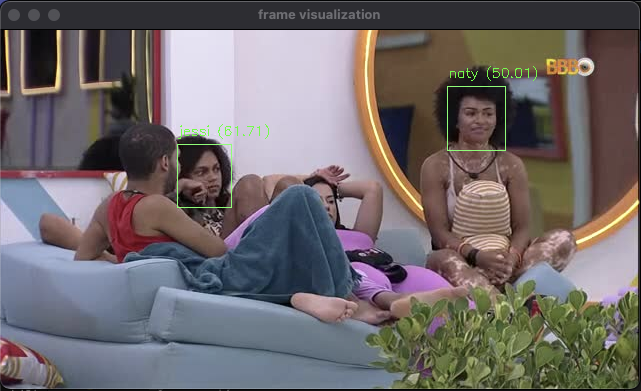

# BBB Face Recognizer

Face recognition system using MTCNN, FACENET, SVM and FAST API to track participants of Big Brother Brasil in real time.

## Instalation

Install dependencies using `requirements.txt`

```shell
pip install -r requirements.txt
```

## Usage

To use the project successfully, you need to follow the steps below.

### 1. Dataset

Is needed to build a dataset through `dataset_generator.py` script.

This script builds a dataset with train and validation directories according by user labeling, using real time cam frames from reality show.

On execute will be created a directory on root with the following structure:

```
dataset
└── train
    └── label1
    └── label2
    └── label3
    └── ...
└── val
    └── label1
    └── label2
    └── label3
    └── ...
```

And you will be able to populate the train dataset.

> If you want populate validation dataset use "-val" as first command line argument.

As the screenshot below, insert the label number that matches with shown face and repeat this process until you have enough data.


For each label input, the .jpg image will be auto stored on respective dataset.

> If you don't recognize the shown face, just leave blank input to skip.

### 2. Model

Now is needed to generate a model through `model_generator.py` script.

Upon successful execution, the accuracy and confusion matrix of train and validation will be presented, and a directory will be created in the root with the following structure:

```
model_files
└── label_encoder.joblib
└── model.joblib
```

This files will be loaded by `face_predictor.py` to use generated model.

### 3. API

Lastly the API can be started.

For development purpose run the live server with command below.

```shell
uvicorn api:app --reload
```

Upon successful run, access in your browser [http://127.0.0.1:8000/cams](http://127.0.0.1:8000/cams) to get a json response with list of cams with recognized faces, like presented below.

```json
[
  {
    "name": "BBB 22 - Câmera 1",
    "location": "Acompanhe a Casa",
    "snapshot_link": "https://live-thumbs.video.globo.com/bbb01/snapshot/",
    "slug": "bbb-22-camera-1",
    "media_id": "244881",
    "stream_link": "https://globoplay.globo.com/bbb-22-camera-1/ao-vivo/244881/?category=bbb",
    "recognized_faces": [
      {
        "label": "arthur",
        "probability": 64.19885945991763,
        "coordinates": {
          "topLeft": [
            118,
            45
          ],
          "bottomRight": [
            240,
            199
          ]
        }
      },
      {
        "label": "eliezer",
        "probability": 39.81395352766756,
        "coordinates": {
          "topLeft": [
            380,
            53
          ],
          "bottomRight": [
            460,
            152
          ]
        }
      },
      {
        "label": "scooby",
        "probability": 37.971779438946054,
        "coordinates": {
          "topLeft": [
            195,
            83
          ],
          "bottomRight": [
            404,
            358
          ]
        }
      }
    ]
  },
  ...
]
```

To see all provided routes access the [documentation](http://127.0.0.1:8000/docs) auto generated by FAST API with Swagger UI.

For more details access [FAST API documentation](https://fastapi.tiangolo.com/).

> If you want to visualize the frame and face recognition on real time, set `VISUALIZATION_ENABLED` to `True` in the `api.py` file (use only for development), for
> each cam frame will be apresented like the screenshot below.



## TO DO

- `cam_scraper.py`: upgrade scrape_cam_frame() to get a high definition cam frame.
